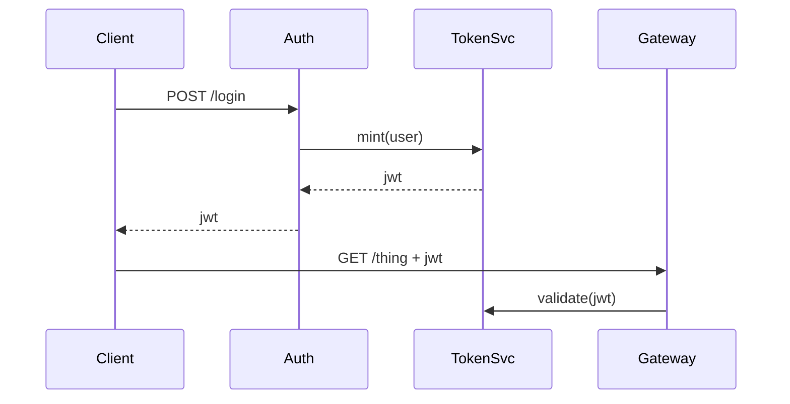

# diagram-it

Draw the thing. One small picture beats three paragraphs about who calls
whom.

## Audience

A human reader who needs to *see* a relationship — components calling
each other, a sequence of events, a hierarchy, a state machine. They
will glance for two seconds before deciding whether to read your prose.
The diagram has to land in that glance.

## When to use

Trigger on any of:
- "draw this" / "diagram" / "visualise" / "picture this" / "sketch"
- "show me the flow" / "how does X call Y" / "what's the sequence"
- The explanation contains five or more "then", "next", "which calls"
  in a row — that's prose smuggling a flowchart
- The user is preparing a doc, slide, or PR description and asks for
  something visual

Do **not** trigger when:
- A single sentence or a short list does the job. A two-node diagram is
  worse than a sentence.
- The reader needs nuance, caveats, or judgment calls — those belong in
  prose. Diagrams flatten.

## Pick the kind first

Choose the diagram type before drawing anything. Wrong kind = wasted
diagram.

| If the point is… | Use | Mermaid keyword |
|---|---|---|
| "A leads to B leads to C" | Flow | `flowchart LR` |
| "A asks B, B replies, B asks C" | Sequence | `sequenceDiagram` |
| "A contains B contains C" | Hierarchy | `flowchart TD` or `graph TD` |
| "thing transitions between modes" | State | `stateDiagram-v2` |
| "two things share these, differ on those" | Compare — *use a table, not a diagram* | — |

If you cannot name which kind in one sentence, you do not yet
understand the relationship well enough to draw it. Write prose first.

## Rules

1. **Five nodes max.** If you need more, you are drawing two diagrams.
   Pick the more important one; describe the rest in prose.
2. **One idea per diagram.** A diagram about "how auth works" is not
   also a diagram about "how sessions expire." Two diagrams.
3. **Label every arrow.** An unlabelled arrow is a lie of omission —
   the reader does not know if it's "calls", "returns to", "depends
   on", or "emits event to".
4. **No decoration.** No colours, no icons, no rounded-vs-square
   styling unless the shape *means* something. Default mermaid styling
   is the goal.
5. **The headline is the takeaway, not the topic.** Above the diagram,
   write one sentence stating what the reader should conclude — not
   "Auth flow" but "The token is minted once, on login, and never
   refreshed."
6. **Prose still does the work.** The diagram is the index; the prose
   is the book. Never paste a diagram and walk away.

## Format

````
> **Takeaway:** [one sentence — what the reader should conclude]

```mermaid
[diagram]
```

[2-4 sentences of prose explaining the parts the diagram cannot —
nuance, edge cases, "why this shape and not the other".]
````

## Example

**Bad** (prose smuggling a flowchart):

> When the user hits `/login`, the request goes to the auth service,
> which validates against the user store, then calls the token service
> to mint a JWT, then returns the JWT to the client, which stores it
> and uses it on subsequent requests to the API gateway, which
> validates it against the token service again on every call.

**Good** (diagram + takeaway + prose):

> **Takeaway:** Every API call re-validates the token — there is no
> client-side trust.



The round-trip to TokenSvc on every call is deliberate: it lets us
revoke tokens immediately rather than waiting for them to expire. The
cost is one extra hop per request, which we accept.

## When the host can't render mermaid

Emit ASCII art as a fallback, same rules: five boxes max, every arrow
labelled, takeaway sentence above.

```
[Client] --POST /login--> [Auth] --mint--> [TokenSvc]
                            |                  ^
                            v                  |
                         [Client] --GET--> [Gateway]
```

## What you are not doing

- You are not drawing the system. You are drawing the *one
  relationship* the reader needs to see.
- You are not producing a publishable diagram. You are producing a
  thinking aid. If the reader needs polish, hand it to a designer.
- You are not replacing the prose. You are giving the reader
  somewhere to point while they read it.
